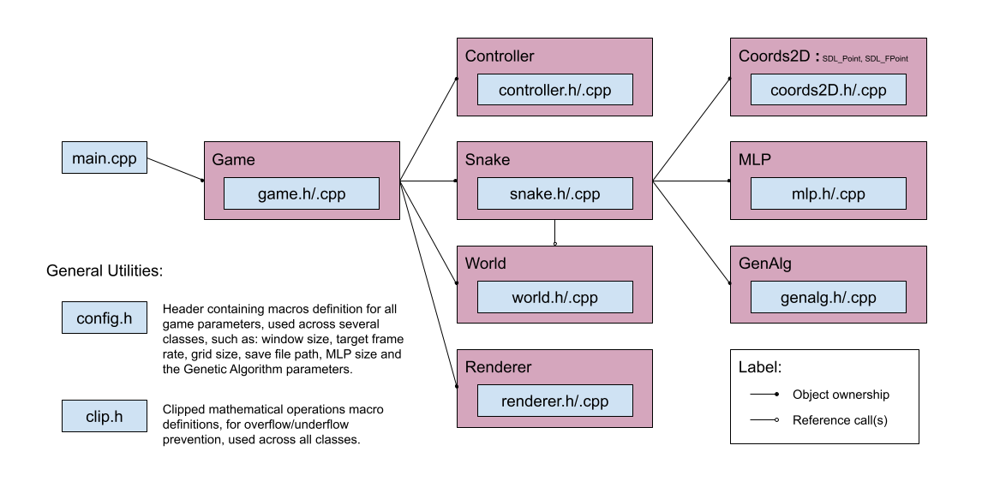

# CPPND: Capstone Snake Game... Evolved!

This is a C++ program developed for the final Capstone project in the [Udacity C++ Nanodegree Program](https://www.udacity.com/course/c-plus-plus-nanodegree--nd213). 
The program is based on the [Starter Snake Game Repo](https://github.com/udacity/CppND-Capstone-Snake-Game), which was expanded with new features, such as the addition of a A.I. learning mode.

## New Game Features

1. **Auto Mode**: press 'A' key at any time during gameplay to toggle back and forth between manual (standard) and a new auto (A.I.) mode (a confirmation pop-up window will appear first). In the latter, the snake is controlled by the CPU, instead of the player, and gradually improves at the game over time - making it more challenging for the player to surpass the CPU record score. Game starts in manual mode by default.
2. **Machine Learning**: Multi-layer Perceptron (MLP) Neural Network used as the CPU's decision model for the snake direction during auto mode, while a Genetic Algorithm is used for the training of the MLP weights (i.e. every generation, the MLP weight sets resulting in the best game scores are selected to breed the next weights sets population).
3. **Speed Mode**: only available during auto (A.I.) mode. Press 'S' key to toggle back and forth between frame rate control (60 fps) and no frame rate control, where the game runs much faster, in order to allow faster A.I. learning process.
4. **Game Pause**: press 'P' key to pause the game (or resume) during any of the modes (manual or auto).
5. **Game Replay**: when in manual (standard) mode, after the snake dies, the player is asked if he wants to play another game round through a pop-up window. On the other hand, in auto (A.I.) mode, no confirmation is needed, and new rounds start automatically after the snake dies.
6. **Infinite Loop Protection**: during auto mode, as the MLP weights are not adapted throughout a game round (and only -between- game rounds), the CPU decisions will be deterministic depending on the snake position and direction in the grid. So, in order to prevent the game to be stuck in a loop, in case a specific snake's position+direction set is reprised before the new food is eaten, the snake is automatically killed.
7. **Special Congratulating Messages**: when the player achieves a new record score, or when the game is completed (i.e. all grid spaces filled with the snake body), a special congratulating message box appears.
8. **Save Data**: both player and CPU score records and A.I. learnings are automatically saved between program executions. If the user wants to reset everything and erase data, 'E' key can be pressed at any time (a confirmation pop-up window will appear first).
9. **Food Generation Efficiency**: improved randomization algorithm for the appearance of new food, considering now only the empty positions in the game grid.
10. **Walls**: addition of collidable walls on the grid boundaries.

## Game Controls

The game controls are the following (they are also displayed in an initial game message window):
1. Arrow keys: controls the snake in Manual mode (i.e. player in control);
2. 'A' key: toggles Auto mode (i.e. CPU in control) on and off;
3. 'S' key: toggles Speed mode (i.e. no frame rate control) on and off (obs.: only available in Auto mode);
4. 'P' key: pauses the game (or resumes it);
5. 'E' key: erases and resets all game data, inclusing record scores and A.I. learning;
6. Close game window: ends the game and exit.

## Dependencies for Running Locally
* OS: Linux
* cmake >= 3.7
  * All OSes: [click here for installation instructions](https://cmake.org/install/)
* make >= 4.1 (Linux)
  * Linux: make is installed by default on most Linux distros
* SDL2 >= 2.0
  * All installation instructions can be found [here](https://wiki.libsdl.org/Installation)
  * Note that for Linux, an `apt` or `apt-get` installation is preferred to building from source.
* gcc/g++ >= 5.4
  * Linux: gcc / g++ is installed by default on most Linux distros
* Eigen C++ Library (Linear Algebra Library)
  * Linux: already included in the project "lib" folder. [More info on the library here.](https://eigen.tuxfamily.org/index.php?title=Main_Page)

## Basic Build Instructions

On Linux:
1. Clone this repo.
2. Make a build directory in the top level directory: `mkdir build && cd build`
3. Compile: `cmake .. && make`
4. Run it: `./SnakeGame`.

## File and Class Structure

The image below depicts the file and class structure of the program:

The main routine owns and calls a Game object, which manages the game states and mechanics and runs it.

In turn, the Game class is composed by a Controller, a Snake, a World and a Renderer objects.
The Controller receives the user inputs, which may change the Game or the Snake state, which in turn may change the World state (representing the game scenario mapping). Finally, the Renderer object is responsible for rendering the Game window based on the current World grid map.

Internally, the Snake class makes use of three other classes: Coords2D is an utility class used to handle the snake's head location continuous and discrete representations at a single place (making sure these two kinds of representations are always aligned); MLP is a class representing a Multilayer Perceptron (MLP), used as the Snake's decision model during A.I. mode; and GenAlg represents the genetic algorithm used for the snake's learning and MLP weights adaptation over the course of the A.I. mode run.

## Addressed Rubric Points

1. The project reads data from a file and process the data, or the program writes data to a file:
    * game.cpp: lines #338, #353;
2. The project accepts user input and processes the input:
    * game.cpp: lines #129, #162;
    * controller.cpp: line #8;
3. The project uses Object Oriented Programming techniques:
    * game.h, controller.h, snake.h, world.h, renderer.h, coords2D.h, mlp.h, genalg.h;
4. Classes use appropriate access specifiers for class members:
    * game.h, controller.h, snake.h, world.h, renderer.h, coords2D.h, mlp.h, genalg.h;
5. Class constructors utilize member initialization lists:
    * game.cpp, snake.cpp, world.cpp, renderer.cpp, coords2D.cpp, mlp.cpp, genalg.cpp;
6. Classes abstract implementation details from their interfaces:
    * game.h, controller.h, snake.h, world.h, renderer.h, coords2D.h, mlp.h, genalg.h;
7. Classes encapsulate behavior:
    * game.h, controller.h, snake.h, world.h, renderer.h, coords2D.h, mlp.h, genalg.h;
8. Classes follow an appropriate inheritance hierarchy:
    * Class with Inheritance: coords2D.h;
    * Classes with Composition:
      * game.h: composed by Controller, Snake, World and Renderer;
      * snake.h: composed by Coords2D, MLP and GenAlg;
9. Overloaded functions allow the same function to operate on different parameters:
    * coords2D.h: constructor and '=' operator overload;
10. Templates generalize functions in the project:
    * coords2D.h: '+' and '+=' operators, on lines #93 and #100;
11. The project makes use of references in function declarations:
    * Several occurrences across all classes header files (game.h, controller.h, snake.h, world.h, renderer.h, coords2D.h, mlp.h, genalg.h);
12. The project uses destructors appropriately:
    * renderer.cpp: line #48;
13. The project uses move semantics to move data, instead of copying it, where possible:
    * genalg.cpp: lines #32, #80 and #82.

